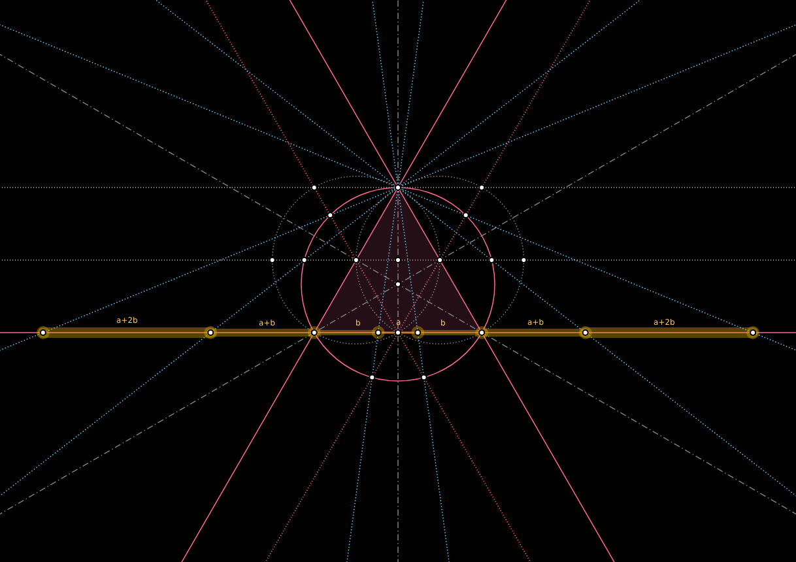

exploring the architecture of all that is
-----------------------------------------

**GEOMETOR** is an open-source initiative dedicated to the
fundamental aspects of geometry, nature, and logic.

.. figure:: arcprize-logo-200.gif
   :align: right

   the machine dreams

All of the research and development for **GEOMETOR** is located here in a
collection of repositories. There are many, but these establish the foundation for the work:

- model_: tools for modeling geometric constructions
- render_: tools for rendering geometric constructions
- divine_: model and analyze the golden ratio
- elements_: extract and codify knowledge from the classic work
- explorer_: explore and interact with geometric models

Each repository has:

- Python source code
- demo code
- source for project website
- discussion group
- log
- todo list
- MIT license

The website for each project is statically-generated and hosted through GitHub.

.. At the heart is the `GEOMETOR explorer`_ - a Python library for building and
.. analyzing geometric constructions with sympbolic algebra.

.. - phyllotaxis
  .. model and investigate geometry of plants

.. - pappus
  .. model and investigate pappus theorem

contribute
----------
We welcome contributions from anyone interested in geometry, mathematics,
nature, or programming. Feel free to contribute to our repositories, raise
issues, or propose enhancements.

discuss
-------
Reach out to us at our official email or via our GitHub profiles for any
queries, suggestions, or discussions. We are always eager to engage with our
community and foster a collaborative environment.

Check out general info on **GEOMETOR**:

- geometor.com_
-

**GEOMETOR** is an organization led by `phi ARCHITECT`_

.. _`phi ARCHITECT`: https://github.com/phiarchitect
.. _model: https://github.com/geometor/model
.. _render: https://github.com/geometor/render
.. _elements: https://github.com/geometor/elements
.. _divine: https://github.com/geometor/divine
.. _explorer: https://github.com/geometor/explorer

.. _geometor.com: https://geometor.com

